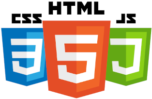

<h1>Programação para Front-end</h1>

## Apresentação

Olá, aluno (a)!

Seja muito bem vindo ao Web Book ***Programação para Front-end***, *um livro técnico aberto publicado como Web Book usando MkDocs*. O objetivo deste material é preparar alunos, iniciantes e entusiastas no desenvolvimento web com as tecnologias *HTML*, *CSS* e *JavaScript*, sendo estas a base do desenvolvimento de aplicações front-end.

Este material é de autoria de *Alex Diego Araujo da Rocha*, um analista de sistemas e professor de tecnologia da região de Maringá. *Alex Rocha* leciona as disciplina a disciplina de *Programação para Front-end* para as turmas do curso de *Tecnologia em Análise e Desenvolvimento de Sistemas* do *Unicesumar*.

A iniciativa da escrita deste material surgiu da necessidade da utilização de conteúdo prático e didático para as turmas dos cursos de graduação em *Tecnologia em Análise e Desenvolvimento de Sistemas* do *Unicesumar*. O objetivo é conciliar um conteúdo simples, bem estruturado e principalmente com o máximo de aplicação prática durante as aulas.

Motivado pelos pedidos de meus alunos, em especial de minha querida aluna *Helen Alves*, que me solicitou materiais escritos para auxiliar em seus estudos, percebi que nenhum dos disponíveis se encaixava perfeitamente em minha didática. Diante disso, decidi elaborar este material, pensando inicialmente em ajudá-la, mas também com o desejo de que ele possa beneficiar outros estudantes. Assim, dedico esta obra à Helen e a todos os alunos que se interessem por este trabalho.

## Conteúdo de Aulas Ministradas

***Unicesumar - Análise e Desenvolvimento de Sistemas Turma ADS3SNA***:  
&nbsp;&nbsp;&nbsp;&nbsp;&nbsp;&nbsp;&nbsp;&nbsp;[Trabalho 01 - 1º Bimestre (até 19/03/2026)](unicesumar/2026/adsi3sna/trabalho_bimestre1_01.md)
&nbsp;&nbsp;&nbsp;&nbsp;&nbsp;&nbsp;&nbsp;&nbsp;[Trabalho 02 - 1º Bimestre (até 15/04/2026)](unicesumar/2026/adsi3sna/trabalho_bimestre1_02.md)
&nbsp;&nbsp;&nbsp;&nbsp;&nbsp;&nbsp;&nbsp;&nb"sp;[Aula 10/03/2026 - Programação do leiaute de *dashboard* - Parte I](unicesumar/2026/adsi3sna/aula_20260310.md)  
&nbsp;&nbsp;&nbsp;&nbsp;&nbsp;&nbsp;&nbsp;&nbsp;[Aula 12/03/2026 - Programação do leiaute de *dashboard* - Parte II](unicesumar/2026/adsi3sna/aula_20260312.md)  
&nbsp;&nbsp;&nbsp;&nbsp;&nbsp;&nbsp;&nbsp;&nbsp;[Aula 17/03/2026 - Programação do leiaute de *dashboard* - Parte III](unicesumar/2026/adsi3sna/aula_20260317.md)  
&nbsp;&nbsp;&nbsp;&nbsp;&nbsp;&nbsp;&nbsp;&nbsp;[REVISÃO DE PROVA - 1º Bimestre - 31/04/2026](unicesumar/2026/adsi3sna/revisao_prova_bimestre_1.md)  

## Sumário

***Unidade I - HTML***  
&nbsp;&nbsp;&nbsp;&nbsp;&nbsp;&nbsp;&nbsp;&nbsp;[Capítulo 1 - Introdução ao HTML](unid_01/html_intro.md)  
&nbsp;&nbsp;&nbsp;&nbsp;&nbsp;&nbsp;&nbsp;&nbsp;[Capítulo 2 - Tags de básicas](unid_01/html_tags_basicas.md)  
&nbsp;&nbsp;&nbsp;&nbsp;&nbsp;&nbsp;&nbsp;&nbsp;[Capítulo 3 - Inputs](unid_01/html_inputs.md)  
&nbsp;&nbsp;&nbsp;&nbsp;&nbsp;&nbsp;&nbsp;&nbsp;[Capítulo 4 - Links e âncoras](unid_01/links_ancoras.md)  
&nbsp;&nbsp;&nbsp;&nbsp;&nbsp;&nbsp;&nbsp;&nbsp;[Capítulo 5 - Listas](unid_01/html_listas.md)  
&nbsp;&nbsp;&nbsp;&nbsp;&nbsp;&nbsp;&nbsp;&nbsp;[Capítulo 6 - Formulários e requisições](unid_01/html_forms.md)  
&nbsp;&nbsp;&nbsp;&nbsp;&nbsp;&nbsp;&nbsp;&nbsp;[Capítulo 7 - Divisórias](unid_01/html_divs.md)  
&nbsp;&nbsp;&nbsp;&nbsp;&nbsp;&nbsp;&nbsp;&nbsp;[Capítulo 8 - Barras de Navegação](unid_01/html_navbars.md)  
&nbsp;&nbsp;&nbsp;&nbsp;&nbsp;&nbsp;&nbsp;&nbsp;[Capítulo 9 - Seções e Artigos](unid_01/html_sessions_articles.md)

***Unidade II - CSS***  
&nbsp;&nbsp;&nbsp;&nbsp;&nbsp;&nbsp;&nbsp;&nbsp;[Capítulo 10 - Introdução ao CSS](unid_02/css_intro.md)  
&nbsp;&nbsp;&nbsp;&nbsp;&nbsp;&nbsp;&nbsp;&nbsp;[Capítulo 11 - Tipos de seletores](unid_02/css_seletores.md)  
&nbsp;&nbsp;&nbsp;&nbsp;&nbsp;&nbsp;&nbsp;&nbsp;[Capítulo 12 - Estilização para textos, títulos e parágrafos](unid_02/css_texto.md)  
&nbsp;&nbsp;&nbsp;&nbsp;&nbsp;&nbsp;&nbsp;&nbsp;[Capítulo 13 - Estilização de divs e containers](unid_02/css_div.md)  
&nbsp;&nbsp;&nbsp;&nbsp;&nbsp;&nbsp;&nbsp;&nbsp;[Capítulo 14 - Flexbox](unid_02/css_flexbox.md)  
&nbsp;&nbsp;&nbsp;&nbsp;&nbsp;&nbsp;&nbsp;&nbsp;[Capítulo 15 - Média Queries](unid_02/css_media_queries.md)  
&nbsp;&nbsp;&nbsp;&nbsp;&nbsp;&nbsp;&nbsp;&nbsp;[Capítulo 16 - Estilização para inputs e forms](unid_02/css_inputs_forms.md)  

***Unidade III - Javascript***  
&nbsp;&nbsp;&nbsp;&nbsp;&nbsp;&nbsp;&nbsp;&nbsp;[Capítulo 17 - Introdução ao Javascript](index.md)

***Unidade IV - Bootstrap***  
&nbsp;&nbsp;&nbsp;&nbsp;&nbsp;&nbsp;&nbsp;&nbsp;[Capítulo 18 - Introdução ao Bootstrap](index.md)

***Unidade V - AngularJS***  
&nbsp;&nbsp;&nbsp;&nbsp;&nbsp;&nbsp;&nbsp;&nbsp;[Capítulo 19 - Introdução ao AngularJS](index.md)

***[Referências](referencias.md)***
