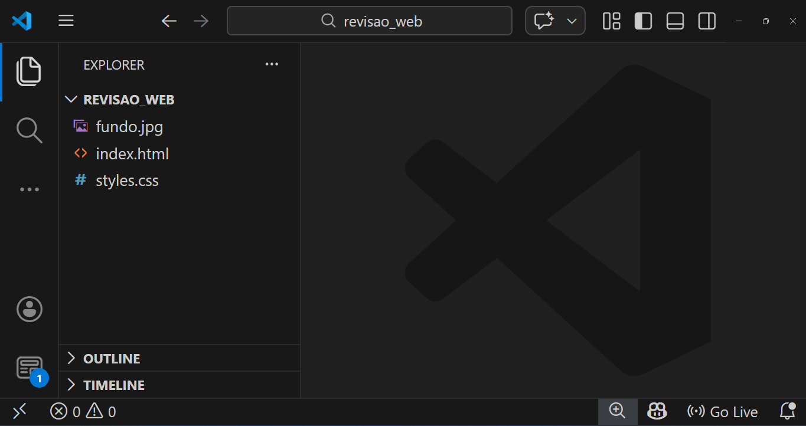

# Revisão de Prova 1º Bimestre - 31/04/2026

Neste material, faremos uma revisão para a prova da disciplina *Programação para Front-end*, lecionada para a turma *ADS3SNA* do *C.S.T em Análise e Desenvolvimento de Sistemas* da **Unicesumar**. A prova será realizada de forma totalmente prática, e testará os seguintes conhecimentos dos alunos:

- Estrutura básica do HTML
- Utilização de divisórias
- Declaração de parágrafos
- Vínculos de arquivos de estilização de páginas (CSS)
- Seletores de classes
- Flex-layout
- Estilização de divs
- Estilização de texto

## Resultado esperado

A revisão consiste em analisar um problema de um cliente, em que:

> Necessita-se de uma página web responsável por exibir um *card* (`div`) para conter uma mensagem que será enviada por *whatsapp*.
>
> **ESPECIFICAÇÕES:**
>
> 1. A página não deverá ter margem e nem espaçamento interno;
> 2. A cor de fundo da tela deverá ser verde-água (`aqua`);
> 3. A `div` *card* deverá ter as dimensões 800x600 e estar **centralizada** na tela;
> 4. O fundo da `div` *card* deve usar a imagem de fundo disponível no link [https://imgur.com/a/NqQelOa](https://imgur.com/a/NqQelOa), e deve cobrir todo o espaço da disponível, sem repetir;
> 5. A mensagem deverá estar centralizada na `div`, a cor `brown`, o tamanho `20px` e o espaçamento interno de `10px`;

<iframe class="stackblitz"
  src="https://stackblitz.com/edit/unicesumar-html-revisao-de-prova-1b?embed=1&file=index.html&view=preview">
</iframe>

## Estrutura básica do HTML

Para desenvolvermos a estrutura básica do HTML, utilizamos o editor de código *Microsoft Visual Studio Code* em conjunto com as extensões [Prettier - Code formatter](https://marketplace.visualstudio.com/items?itemName=esbenp.prettier-vscode), [Auto Close Tag](https://marketplace.visualstudio.com/items?itemName=formulahendry.auto-close-tag) e [Live Server](https://marketplace.visualstudio.com/items?itemName=ritwickdey.LiveServer).

Após a configuração do editor de código, criaremos uma nova pasta onde armazenaremos os arquivos do site. Após adicionar, abrimos essa pasta como contexto do editor *Microsoft Visual Studio Code*.


Dentro da pasta, adicionaremos os arquivos `index.html` e `styles.css`, além de baixar a imagem `fundo.jpg` do link [https://imgur.com/a/NqQelOa](https://imgur.com/a/NqQelOa).



Acessando o arquivo `index.html`, adicionaremos a estrutura básica do HTML.

> Você pode usar o *snippet* do *HTML Sample* digitando `!` ou `html:5` e pressionando as teclas `ctrl` + `Enter` para adicionar a estrutura básica do HTML.

```html
<!DOCTYPE html>
<html lang="en">
<head>
    <meta charset="UTF-8">
    <meta name="viewport" content="width=device-width, initial-scale=1.0">
    <title>Document</title>
</head>
<body>
    
</body>
</html>
```

Em seguida, adicionaremos a `div` do *card* e o parágrafo do conteúdo dentro da tag `body`.

> Você pode usar o seguinte *snippet* para adicionar a `div` com a classe e o parágrafo: `.quadro>h1`. Ao final, pressione `ctrl` + `Enter` para abrir a intelisense e `Enter` para selecionar o *snippet*.


```html
    <div class="quadro">
      <p>
        Minha terra tem palmeiras, Onde canta o Sabiá; As aves,
        que aqui gorjeiam, Não gorjeiam como lá. Nosso céu tem mais estrelas,
        Nossas várzeas têm mais flores, Nossos bosques têm mais vida, Nossa vida
        mais amores. Em cismar, sozinho, à noite, Mais prazer eu encontro lá;
        Minha terra tem palmeiras, Onde canta o Sabiá. Minha terra tem primores,
        Que tais não encontro eu cá; Em cismar –sozinho, à noite– Mais prazer eu
        encontro lá; Minha terra tem palmeiras, Onde canta o Sabiá. Não permita
        Deus que eu morra, Sem que eu volte para lá; Sem que disfrute os
        primores Que não encontro por cá; Sem qu'inda aviste as palmeiras, Onde
        canta o Sabiá.
      </p>
    </div>
```

Na tag `head` devemos adicionar a referência do arquivo de estilização `styles.css`. Para isso, escrevemos a tag `link`, colocando os atributos `rel="stylesheet"` e `href="styles.css"`.

```html
  <head>
    <meta charset="UTF-8" />
    <meta name="viewport" content="width=device-width, initial-scale=1.0" />
    <title>Document</title>
    <link rel="stylesheet" href="styles.css" />
  </head>
```

## Estilizando a página com CSS

Iniciaremos a estilização dentro do arquivo `styles.css` resetando os valores de margem e espaçamento interno da página. Para isso, usamos o seletor `*` juntamente com as propriedades `padding` e `margin`, referentes a espaçamento interno e margem, respectivamente. Para ambas propriedades, o valor será `0`.

```css
* {
  padding: 0;
  margin: 0;
}
```

Para atendermos ao requisitos **1**, **2** e **3**, referentes à cor de fundo e a centralização da `div` de conteúdo, usaremos as seguintes propriedades no seletor `body`:

- `width`: para definir o valor máximo de `100vw` na largura, que representa 100% da **largura** do *viewport* da janela do navegador.
- `height`: para definir o valor máximo de `100vh` na altura, que representa 100% da **altura** do navegador.
- `background-color`: para definir a cor de fundo com o valor `aqua` do `body`.
- `display`: para definir a `div` com o *flex-layout*, essencial para as propriedades `align-items` e `justify-content` funcionarem corretamente.
- `align-items`: para definir o *alinhamento no eixo central* (vertical) da div com o valor `center`.
- `justify-content`: para definir o *alinhamento no eixo cruzado* (horizontal) da div com o valor `center`.

> As propriedades `display: flex`, `align-items: center` e `justify-content: center` são essenciais para fazer o alinhamento central de conteúdo numa `div`.

```css
body {
  width: 100vw;
  height: 100vh;
  background-color: aqua;
  display: flex;
  align-items: center;
  justify-content: center;
}
```

Para estilizar a `div` de conteúdo, utilizaremos o seletor da classe `.quadro`, e atribuiremos as seguintes propriedades:

- `border`: Definiremos a margem, para que fique aparente. Utilizamos os valor `1px solid black`, para indicar a espessura, o tipo e a cor da margem, respetivamente.
- `width`: Definiremos a largura para o valor de `600px`
- `height`: Definiremos o valor da altura para `480px`
- `background-image`: Responsável por definir uma imagem de fundo para o elemento. Utilizaremos a função `url("fundo.jpg")` para associar a propriedade ao arquivo `fundo.jpg` baixado.
- `background-repeat`: Utilizaremos o valor `no-repeat` para impedir que a imagem repita caso não tenha a mesmo dimensionamento da `div`.
- `background-size`: Utilizaremos o valor `cover` para indicar que a imagem cobrirá todo o espaço disponível do elemento. Obs.: Pode ser que a imagem distorça.
- `display`: Utilizaremos o valor `flex` para indicar que essa `div` utilize o `flex-layout`. Nossa intenção é centralizar o parágrafo. 
- `align-items`: para definir o *alinhamento no eixo central* (vertical) da div com o valor `center`.
- `justify-content`: para definir o *alinhamento no eixo cruzado* (horizontal) da div com o valor `center`.

```css
.quadro {
  border: 1px solid black;
  width: 600px;
  height: 480px;
  
  background-image: url("fundo.jpg");
  background-repeat: no-repeat;
  background-size: cover;

  display: flex;
  justify-content: center;
  align-items: center;
}
```

Por fim, formataremos o parágrafo. Como a intenção é afetar somente o parágrafo dentro da `div`, utilizaremos o seletor combinado para filhos (diretor e indiretos). Sendo assim, especificamos o seletor `.quadro p`.

> Caso quiséssemos afetar somente o parágrafo filho direto da div, poderíamos utilizar o seletor `.quadro > p`.

As seguintes propriedades foram indicadas:

- `color`: Utilizamos o valor `brown` para indicar a cor do conteúdo do parágrafo com o valor *marrom*;
- `text-align`: Justificamos o conteúdo de texto do parágrafo com o valor `justify`;
- `padding`: O espaçamento interno foi definido com o valor `10px`;
- `font-size`: Definimos o tamanho da fonte para `20px`;
- `-webkit-text-stroke`: ***(OPCIONAL)*** Utilizado para definir a largura e a cor do contorno de caracteres de texto. Definimos o valor `2px black`, sendo este a cor do contorno e aquele a largura do contorno.

> A propriedade `-webkit-text-stroke` não é padronizada, e funciona em apenas alguns navegadores. Você pode buscar mais informações neste link: [-webkit-text-stroke](https://developer.mozilla.org/en-US/docs/Web/CSS/Reference/Properties/-webkit-text-stroke).


```css
.quadro p {
    color: white;
    padding: 35px;
    text-align: justify;
    font-size: 20px;
    -webkit-text-stroke: 1px black;
}
```

## Conclusão

Nesta revisão de prova, revisitamos conceitos importantes sobre a estruturação básica de uma página HTML, utilizando elementos básicos como `div` e o parágrafo `p`. Também vimos como vincular um arquivo de estilização de páginas em CSS ao arquivo HTML utilizando a tag `link`. Por fim, estilizamos toda a página centralizando elementos, definindo cores e imagens como planos de fundo.