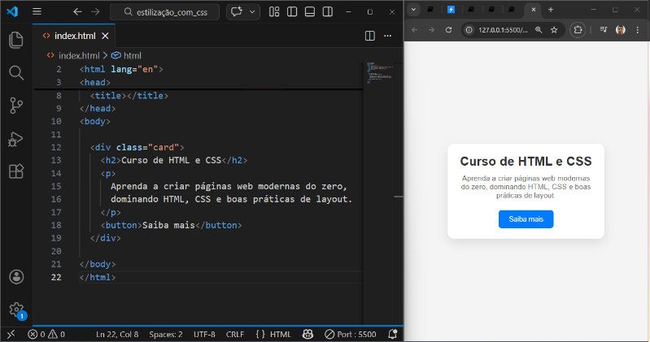

# UNICESUMAR - ADS3SNA - 2026 - Programação para front-end - Trabalho 1º BI (valor 1,0)

> **Link para entrega**: [https://forms.gle/4UJP4J82o2f2Ndip6](https://forms.gle/4UJP4J82o2f2Ndip6)  
> **Data final**: ***19/03/2026***  
> **Formatos aceitos**: *.html*, *.css*, *.zip*  
> **Valor**: 1,0

## Instruções

**Inclua a formatação em CSS para deixar a o card com as seguintes características:**

```html
  <div class="card">
    <h2>Curso de HTML e CSS</h2>
    <p>
      Aprenda a criar páginas web modernas do zero,
      dominando HTML, CSS e boas práticas de layout.
    </p>
    <button>Saiba mais</button>
  </div>
```

**Por isso, faça:**

 - Resete a página para não ter margem e nem espaçamento interno.
 - Configure o body para ocupar 100 do viewport e mude o display para flex. Alinhe os itens ao center e justifique os itens ao center. Mude a cor para um "branco-gelo". - Centralize o card no meio da página;
 - Coloque o título do card em negrito, com a fonte 24px e a cor cinza;
 - Coloque uma margem inferior no parágrafo de 20px e a cor da fonte em cinza-claro e a fonte em 24px;
 - Coloque o botão com a cor de fundo azul, a cor da fonte em branco, sem nenhuma espessura de borda, com a borda radial de 6px, mude o cursor do mouse para pointer e, ao posicionar o mouse em cima do botão, mude a cor para azul-claro.

***O resultado esperado deve ser:***



## Entrega

O trabalho deve ser entregue pelo formulário [https://forms.gle/4UJP4J82o2f2Ndip6](https://forms.gle/4UJP4J82o2f2Ndip6) até o dia ***19/03/2026***. Não serão aceitas entregas após a data. Siga as instruções do formulário:

- Anexe os arquivos index.html e style.css em em formato .zip. Caso o CSS esteja na tag <style></style>, anexe somente o index.html.  
- Obs.: Você pode compactar os arquivos em .zip utilizando o Winrar ou 7-Zip. Não inclua senha no arquivo.