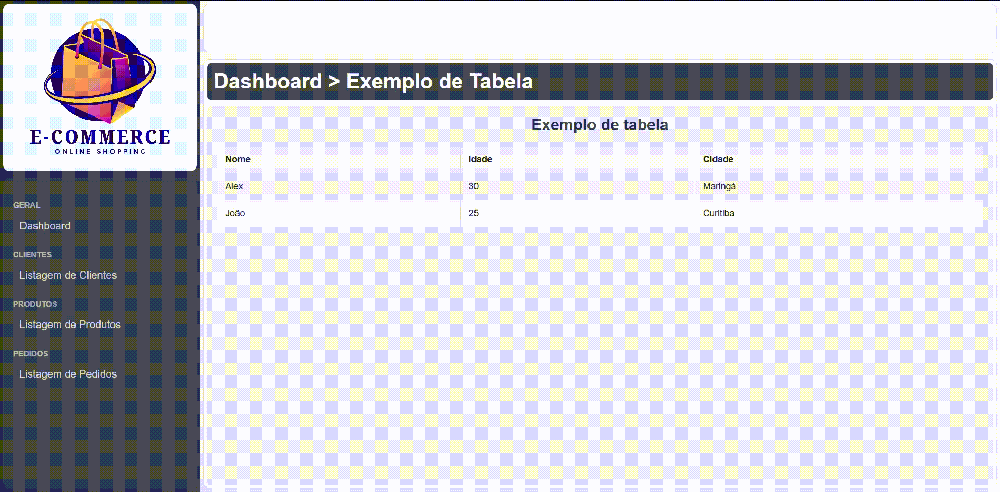

# UNICESUMAR - ADS3SNA - 2026 - Programação para front-end - 2º Trabalho 1º BI (valor 2,0)

> **Link para entrega**: [https://forms.gle/53zFSSPopqZWWodN7](https://forms.gle/53zFSSPopqZWWodN7)  
> **Data final**: ***15/04/2026***  
> **Formatos aceitos**: *.html*, *.css*, *.zip*  
> **Arquivos do projeto**: [download](./assets/unicesumar-trabalho-2-1-bimestre.zip)  
> **Valor**: 2,0

## Instruções

**Desenvolva as telas de Listagem de Clientes, Produtos e Pedidos para o projeto do Dashboard.**

O projeto pode ser baixado em [https://stackblitz.com/edit/unicesumar-trabalho-2-1-bimestre](https://stackblitz.com/edit/unicesumar-trabalho-2-1-bimestre) ou diretamente em .zip [clicando aqui](./assets/unicesumar-trabalho-2-1-bimestre.zip).

<iframe class="stackblitz"
  src="https://stackblitz.com/edit/unicesumar-trabalho-2-1-bimestre?embed=1&file=index.html&view=preview">
</iframe>

### Especificações

- Será necessário adicionar três arquivos html com o mesmo template: `cliente-lista.html`, `produto-lista.html` e `pedido-lista.html`. Todos devem seguir o mesmo leiaute do `index.html`.
- Para cada um dos links, deve ser adicionado uma página, copiando seu leiaute, porém alterando seu conteúdo para tabelas de listagem de dados.
- Cada página de listagem (Listagem de Clientes, Listagem de Produtos e Listagem de Pedidos) deve conter uma tabela (<table>) com a formatação desejada;
- Os dados adicionados serão fictícios, devendo ter 10 linhas para cada listagem.
- **Além disso, será necessário ligar os os links `<a>` a cada uma das páginas criadas.**

**Por isso, faça:**

Em cada arquivo, colocar 10 registros de cada um dos itens a seguir:

**Listagem de Clientes - Campos:**

- Id
- Nome
- Sobrenome
- CPF
- Telefone
- Endereço

**Listagem de Produtos - Campos:**

- Id
- Descrição
- Código de Barras
- Estoque
- Valor

**Listagem de Pedido - Campos:**

- Id
- Cliente
- Data da Movimentação
- Valor Total

## Resultado esperado

Ao final do trabalho, espera-se o seguinte resultado:

## Entrega

O trabalho deve ser entregue pelo formulário [https://forms.gle/53zFSSPopqZWWodN7](https://forms.gle/53zFSSPopqZWWodN7) até o dia ***15/04/2026***. Não serão aceitas entregas após a data. Siga as instruções do formulário:

- Anexe os arquivos criados em em formato .zip.
- Obs.: Você pode compactar os arquivos em .zip utilizando o Winrar ou 7-Zip. Não inclua senha no arquivo.