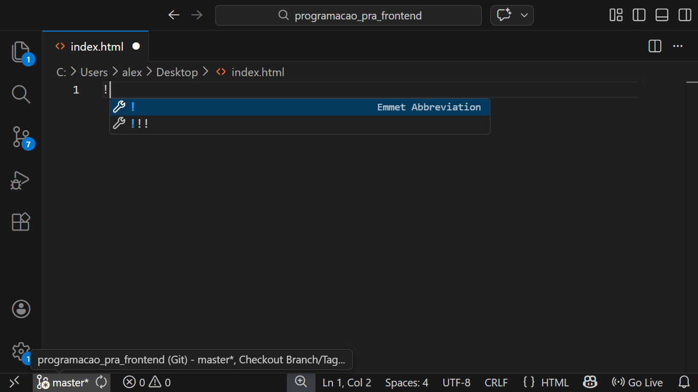

# Introdução ao HTML

> "Este é um pequeno passo para o homem, mas um salto gigantesco para a humanidade."  
> — Neil Armstrong

Olá, aluno(a)!

Neste capítulo, daremos início ao estudo da estrutura das páginas HTML, conhecendo seus elementos principais, tags e atributos de tags. Conhecer os elementos das páginas HTML de forma detalhada nos ajudará a entender a sua aplicação prática, sendo o primeiro passo para você se tornar um ótimo desenvolvedor front-end.

O conteúdo a ser visto nesta unidade é base para o entendimento completo da programação front-end, já que essa é um misto de diversas tecnologias, sendo as três principais o HTML, o CSS e o Javascript. É claro que o desenvolvimento das aplicações web mais modernas utiliza os famosos frameworks, como o Bootstrap, muito utilizado para estilização, e também o AngularJS e o React, utilizados para desenvolvimento de aplicações SPA (Single Page Application), mas para que alcancemos o desenvolvimento com todas essas tecnologias citadas, começaremos aprendendo a mais básica de todas elas, o HTML.

Aproveite esta jornada, caro(a) aluno(a), e enriqueça ainda mais seu conhecimento com o aprendizado deste livro. Teremos uma longa jornada pela frente, mas cada passo será fundamental para sua carreira.

## Definição

# Estrutura inicial do HTML

Praticamente todas as páginas web disponíveis hoje foram escritas - ou traduzidas de outras tecnologias - para HTML, CSS e Javascript, sendo essas as tecnologias que qualquer *browser* executa. Em todas as páginas HTML, há praticamente a mesma estrutura básica, escrita utilizando *tags* como em um arquivo XML (*eXtensible Markup Language*).

Independentemente da complexidade da página visualizada, essa mesma estrutura básica está lá, utilizada para encapsular todo o conteúdo da página. Vamos observar essa estrutura a seguir:

```html
<!DOCTYPE html>
<html lang="en">
<head>
    <meta charset="UTF-8">
    <meta name="viewport" content="width=device-width, initial-scale=1.0">
    <title>Document</title>
</head>
<body>
    
</body>
</html>
```

O código apresentado mostra a estrutura de uma simples página HTML, gerada automaticamente em um arquivo *index.html* no editor de código *Microsoft Visual Studio Code* com o *snippet* `!` ou `html:5`. Observe que a estrutura possui poucas tags, e algumas tem sua função facilmente deduzíveis através de seus nomes, como é o caso das tags `<html>`, `<head>` e `<body>` e `<title>`, sendo a *tag* de estrutura principal, a *tag* de cabeça - ou cabeçalho -, a *tag* de corpo, e a *tag* de título, respectivamente.

Essas *tags* citadas organizam todo o conteúdo que será escrito no documento e renderizado como página no *browser* do usuário, como o título da página, os elementos de texto e imagens, links e principalmente controles de formulários de requisição. Todos esses elementos ficarão contidos dentro do conteúdo da *tag* `<body>`, entre seus delimitadores - `<body> [CONTEÚDO DO BODY] </body>`.

Por outro lado, temos *tags* que não são facilmente dedutíveis, como é o caso das *tags* `<meta>`, que aparece pelo menos duas vezes no código, além da tag `<!DOCTYPE html>`, que aparecem no início do documento. Veremos com calma a função de cada uma dessas tags na estrutura, mas o mais importante agora é que você entenda como iniciar um documento HTML utilizando as tags obrigaórias para isso.

Para facilitar seu entendimento, vou apresentar a seguir uma tabela contendo uma breve descrição de cada uma das *tags* vista na estrutura básica do HTML:

|*Tag*|Descrição|
|---|---|
|`<!DOCTYPE html>`|*Tag* responsável por identificar um documento HTML. 99% das páginas web são HTML. Essa tag é padronizada assim pelo HTML 5.|
|`<html lang="en">`|*Tag* responsável por definir e conter toda a estrura da página, ou seja o `<head>` e `<body>`. O atributo `lang="en"` define o idioma da página. No Brasil usamos `lang="pt-BR"`.|
|`<head>`|*Tag* responsável por delimitar o conteúdo de cabeçalho, isto é o título da página, definido pela *tag* `<title>` e as configurações de exibição definidas pelas tags `<meta>`. Essa tag também pode conter os links para páginas de estilização e arquivos de script.|
|`<meta charset="UTF-8">`|*Tag* responsável pela configuração do conjunto de caracteres da página. O padrão é o `UTF-8`|
|`<meta name="viewport" content="width=device-width, initial-scale=1.0">`|*Tag* responsável pelo controle de responsividade da página em dispositivos móveis. Sem ela, os navegadores móveis simulam uma tela grande de desktop e depois reduzem a página inteira, o que deixa tudo pequeno.|
|`<title>`|*Tag* responsável por definir o título da página|
|`</title>`|Encerramento da *tag* `<title>`|
|`</head>`|Encerramento da *tag* `</head>`|
|`<body>`|*Tag* responsável por conter todo o conteúdo visível da página: títulos, textos, links, campos, imagens, etc. É a *tag* em que mais iremos trabalhar|
|`</body>`|Encerramento da *tag* `<body>`|
|`</html>`|Encerramento da *tag* `<html>`|

## Elementos vazios e elementos de conteúdo

Vamos fazer uma parada para entender um conceito importante aqui. Você notou que todas as *tags* iniciaram com seus respectivos nomes, mas algumas encerraram na mesma linha e outras encerraram com uma outra *tag*, com o mesmo nome, porém com o caractere `/` (barra) na frente? Se sim, então você percebeu que existem **elementos vazios**, como no caso das *tags* `<meta>` e **elementos de conteúdo**, como nas *tags* `<html></html>`, `<head></head>`, `<title></title>` e `<body></body>`.

As *tags* de elementos vazios (*Empty Elements*) são tags que não possuem conteúdo interno, pois elas por si só já são consideradas a informação necessária. Elas podem ser metadados de informação, campos de formulários, imagens, links e até mesmo vinculação de arquivos de estilização. Elas sempre seguem essa estrutura:

```html
    <tag atributo1="valor1" atributo1="valor1"/>
```

Observe que a *tag* inicia e fecha com `/>` na mesma instrução, independentemente se a linha foi quebrada ou não.


Já os elementos que possuem conteúdo (*Container elements*), precisam abrir e fechar em *tags* separadas. Por exemplo:

```html
<tag>
    conteúdo
</tag>
```

Isso acontece porque muitas vezes o conteúdo desses elementos é muito grande, então a formatação do HTML divide abertura e o encerramento em tags separadas, sendo a última encerrada por `</>`. Geralmente essas tags são divisórias, títulos de página, parágrados, seções, artigos, e etc.

## Atributos

Independentemente do tipo de elemento, qualquer um deles podem ter atributos, que são informações complementares do próprio elemento na página. Vimos no primeiro exemplo as *tags* `<html lang="en">`, com o atributo `lang="en"`, e `<meta name="viewport" content="width=device-width, initial-scale=1.0">`, com os atributos `name="viewport"` e `content="width=device-width, initial-scale=1.0"`. 

Os atributos completam a informação do elemento, modificando seus valores e o comportamento da tela e dos elementos que os contém. Durante toda nossa jornada, vereremos a aplicação de atributos em quase todas os elementos, usados para estilização dimensionamento, atribuição de valores iniciais e até mesmo controle de do formulário de requisição.

## Construindo a primeira página: index.html

Com os conhecimentos introdutórios aprendidos, vamos escrever nossa primeira página em HTML. À primeira vista, podemos criar um arquivo com qualquer nome, desde que a extensão do arquivo seja `.html`, para que tanto o editor de código possa reconhecer a linguagem quanto o `browser` renderize o conteúdo da página quando essa for requisitada. 

No entanto, por se tratar da página inicial, recomendo que, ao criar o arquivo, você o nomeie com o nome `index.html`. Isso irá permitir que, ao requisitar a url de um servidor, local ou remoto, o arquivo possa ser exibido de forma automática, sem especificar seu nome após o texto da url.

> O arquivo `index.html` - ou com outras extensões, como `index.php`, `index.jsp`, `index.aspx`, etc. - é o primeiro arquivo a ser exibido, não sendo necessária a especificação do nome na url. O servidor web se encarrega que verificar se há um arquivo index e o retorna naturalmente na primeira requisição. Ex.: `https://www.google.com` em vez de `https://www.google.com/index.html`.

Após criar o arquivo `index.html`, coloque a estrutura básica do HTML no documento. Caso esteja utilizando algum editor de código, como o *Microsoft Visual Studio Code*, você pode digitar o caractere `!` pressionar as teclas `Ctrl` + `Espaço` para listar os *snippets* do editor. Em seguida, você seleciona a primeira opção e pressiona `Enter`.



A estrutura que obteremos será a mesma do primeiro exemplo. Iremos fazer apenas duas modificações no código, sendo a mudança no título `<title>Olá, Mundo!</html>` e no corpo `<body>Minha primeira página em HTML</body>`. Observe:

```html
<!DOCTYPE html>
<html lang="en">
<head>
    <meta charset="UTF-8">
    <meta name="viewport" content="width=device-width, initial-scale=1.0">
    <title>Olá, Mundo!</title>
</head>
<body>
    Minha primeira página em HTML
</body>
</html>
```

Após a digitação, podemos salvar o arquivo e dar dois cliques nele para o *broser* abrir. Caso você esteja utilizando algum servidor de páginas web, como o *Xampp*, *Wampp*, *Apache*, ou mesmo utilizando alguma extensão do *vscode*, como o *Live Server*, execute os comandos necessários para renderizar a página no navegador.

O resultao obtido será igual ou próximo a isto:

<iframe class="stackblitz"
  src="https://stackblitz.com/edit/programacao-para-frontend-html-intro-index?embed=1&file=index.html&view=both">
</iframe>

## Conclusão

E assim chegamos ao final deste primeiro capítulo. Vimos a base dos conceitos para criar nossa primeira página web, entendemos o que são tags e atributos, além de visualizarmos a página construída diretamente por um browser.